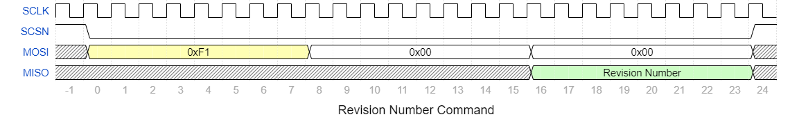
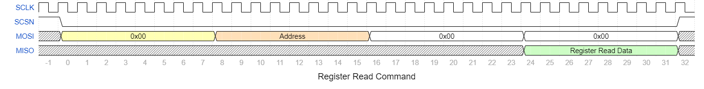
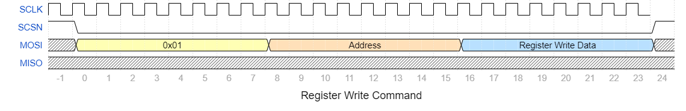
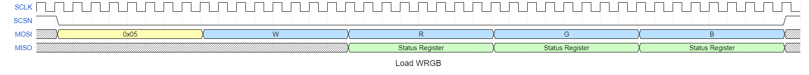
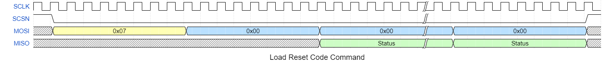

# SpiPixelController

Lattice MachXO2 FPGA SPI Slave to NeoPixel/WS2812 Controller.  The
SpiPixelController accepts SPI commands from a Master which contain RGB
or WRGB data and converts that to WS2812 or similar serial output.  The
FPGA utilizes the MachXO2 EFB FIFO and the EFB User Slave SPI.  The FIFO
is configured to provide a 1024 by 32bit buffer which is used for RGB or
WRGB values and Reset Cycle and Reset Code words. The FPGA provides two
modes of operation.  Wait for Reset and Continuous Mode. In Wait For Reset
mode the serialization of the RGB data will only occur when a Reset Cycle
or Reset Code has been placed into the FIFO.  This allows for a maximum
of 1023 LEDs and 1 Reset Command.  In continuous mode, the flow control
is pushed to the user but the FPGA does not wait for a Reset allowing
longer strips then the buffer.  However, in the event that the FIFO becomes
empty, a Reset Code will be inserted.  The FPGA provides configurable
Almost Full and Almost Empty output signals.  In addition the SPI command
protocol will return the contents of the status register when performing RGB
or WRGB Load Commands.

# SpiPixelController Target Device

Target Device: **LCMXO2-1200HC-4SG32C**

Lattice MachXO2
* XO2-1200HC
* Package: 32-QFNS (5x5)
* Speed Rating: -4
* Commercial Temperatures

IO Voltage: **3.3V**

# SpiPixelController SPI Slave Performance

The SpiPixelController utilizes the MachXO2's hardened User SPI Slave EFB and can operate
with a SPI Clock of **20Mhz or less**.  However, achieving that speed is highly dependent on
the PCB and/or wiring of the system and may not be achievable.

# SpiPixelController Device Pinout

FPGA Function | Dual Function | QFN32 Pin | Design Signal
------------- | ------------- | --------- | -------------
PL9A          | PCLKT3_0      | 4         | LED_OUT
PL9B          | PCLKC3_0      | 5         | ERROR
VCCIO3        | -             | 6         | 3.3V
VCCIO2        | -             | 7         | 3.3V
PB4C          | CSSPIN        | 8         | -
PB6C          | MCLK/CCLK     | 9         | SCLK
PB6D          | SO/SPISO      | 10        | MISO
PB9A          | PCLKT2_0      | 11        | GPO[1]
PB9B          | PCLKC2_0      | 12        | GPO[0]
PB11A         | PCLKT2_1      | 13        | RST_N
PB11B         | PCLKC2_1      | 14        | SCSN
VCCIO2        | -             | 15        | 3.3V
PB20C         | SN            | 16        | -
PB20D         | SI/SISPI      | 17        | MOSI
VCC           | -             | 18        | 3.3V
VCCIO1        | -             | 19        | 3.3V
PR5D          | PCLKC1_0      | 20        | FIFO_AEMPTY
PR5C          | PCLKT1_0      | 21        | FIFO_AFULL
PT17D         | DONE          | 23        | -
VCCIO0        | -             | 24        | 3.3V
PT15D         | PROGRAMN      | 25        | -
PT15C         | JTAGENB       | 26        | -
PT12D         | SDA/PCLKC0_0  | 27        | -
PT12C         | SCL/PCLKT0_0  | 28        | -
PT11D         | TMS           | 29        | -
PT11C         | TCK           | 30        | -
VCCIO0        | -             | 31        | 3.3V
PT10D         | TDI           | 32        | -
PT10C         | TDO           | 1         | -
VCC           | -             | 2         | 3.3V
GND           | -             | 3         | GND
GND           | -             | 22        | GND

```
Notes:
1) Design Signals with "-" indicate Not Connected.
2) It is recommended that signals SN and MISO have external pull up resistors.
```

# SPI Commands
SPI is a serialized byte interface and by itself does not define a communication
protocol.  The following SPI communication protocol is used to operate the
SpiPixelController.

Command          | Command Byte | Address Byte | Dummy Byte | Data Byte(s)
---------------- | ------------ | ------------ | ---------- | ------------
Hardware ID      | 0xF0         | -            | 1          | 1
Revision Number  | 0xF1         | -            | 1          | 1
Register Read    | 0x00         | 1            | 1          | 1+
Register Write   | 0x01         | 1            | -          | 1+
Load RGB         | 0x04         | -            | -          | 1+
Load WRGB        | 0x05         | -            | -          | 1+
Load Reset Cycle | 0x06         | -            | -          | 1+
Load Reset Code  | 0x07         | -            | -          | 1+

```
Notes:
1) Command fields with "-" indicate they are not present.
2) During Load RGB, Load WRGB, Load Reset Cycle and Load Reset Code commands the
   Status Register value is returned on the MISO. The Status Register has fields
   for the state of the FIFO and can be used for flow control by the Master.
3) During Reset Cycle and Code commands the data byte value is ignored but for
   each byte an additional reset (either cycle or code) will be inserted.
4) Dummy Bytes allow for the FPGA to fetch and load TX buffers and are required
   where indicated.
```

### Hardware ID Command


### Revision Number Command



### Register Read Command



### Register Write Command



### Load RGB Command


### Load WRGB Command



### Load Reset Cycle Command


### Load Reset Code Command



# Device Registers
Register            | Offset | Bit 7 | Bit 6 | Bit 5 | Bit 4 | Bit 3 | Bit 2  | Bit 1   | Bit 0
------------------- | ------ | ----- | ------ | ----- | ----- | ----- | -----  | -----   | -----
Status              | 0x00   | -     | WERROR | OVER  | UNDER | AFULL | AEMPTY | FULL    | EMPTY
Configuration       | 0x01   | -     | -      | -     | -     | -     | -      | MODE    | ENABLE
WRGB Format         | 0x02   | 7     | 6      | 5     | 4     | 3     | 2      | 1       | 0
Full MSB            | 0x03   | -     | -      | -     | -     | -     | 10     | 9       | 8
Full LSB            | 0x04   | 7     | 6      | 5     | 4     | 7     | 7      | 7       | 7
Empty MSB           | 0x05   | -     | -      | -     | -     | -     | 10     | 9       | 8
Empty LSB           | 0x06   | 7     | 6      | 5     | 4     | 3     | 2      | 1       | 0
Zero High Timing    | 0x07   | 7     | 6      | 5     | 4     | 3     | 2      | 1       | 0
Zero Low Timing     | 0x08   | 7     | 6      | 5     | 4     | 3     | 2      | 1       | 0
One High Timing     | 0x09   | 7     | 6      | 5     | 4     | 3     | 2      | 1       | 0
One Low Timing      | 0x0A   | 7     | 6      | 5     | 4     | 3     | 2      | 1       | 0
Reset Cycle Timing  | 0x0B   | 7     | 6      | 5     | 4     | 3     | 2      | 1       | 0
Reset Code Timing   | 0x0C   | 7     | 6      | 5     | 4     | 3     | 2      | 1       | 0
Run                 | 0x0D   | -     | -      | -     | -     | -     | -      | -       | RUN/STOP
GPIO Value          | 0xF0   | -     | -      | -     | -     | -     | -      | GPO1    | GPO0
GPIO Direction      | 0xF1   | -     | -      | -     | -     | -     | -      | GPO1_EN | GPO0_EN
Scratch Pad 1       | 0xF2   | 7     | 6      | 5     | 4     | 3     | 2      | 1       | 0
Scratch Pad 2       | 0xF3   | 7     | 6      | 5     | 4     | 3     | 2      | 1       | 0
Scratch Pad 3       | 0xF4   | 7     | 6      | 5     | 4     | 3     | 2      | 1       | 0
Scratch Pad 4       | 0xF5   | 7     | 6      | 5     | 4     | 3     | 2      | 1       | 0

```
Notes:
1) Register bit fields with "-" indicate they are reserved and will be 0 when read.
2) Timing Registers are only writable when ENABLE is 0 or when the FIFO is empty.  A
   Write Error will occur when a write occurs and the device is ENABLED or the FIFO is
   not empty.
```

# File Structure

## Lattice Diamond Project Files:

```
./prj/
  -> fifo_dc_efb/         : IPexpress files for the FIFO EFB
  -> slave_efb/           : IPexpress files for the User SPI Slave
  -> /top/                : Lattice Diamond top level project
    -> top_4SG32C.ldf     : Top level Lattice Diamond project file in the 4SG32C package
    -> top_6SG32I.ldf     : Top level Lattice Diamond project file in the 6SG32I package
    -> top1.sty           : Top level Lattice Diamond strategy file
./syn/machxo2_qfn32.lpf   : Design IO constraints
```

## RTL Design:
```
./rtl/
  -> ctrl.v               : Wishbone and SPI Command controller
  -> fifo_dc_efb.v        : EBF FIFO instance
  -> regs.v               : Device Registers
  -> ser.v                : Device WS2812 serializer
  -> slave_efb.v          : EBF SPI Slave instance
  -> top.v                : Top level
```

## Test Bench:
```
./rpi/
  -> rpi_debug_test.py    : Raspberry Pi Python FPGA Checkout Test
  -> rpi_strand_test.py   : Raspberry Pi Python FPGA Strand Test

./sim/
  -> macros/
    -> test_gpo.do        : Active HDL do macro to launch GPO test
    -> test_registers.do  : Active HDL do macro to launch Registers test
    -> test_rgb.do        : Active HDL do macro to launch RGB pixel test
    -> test_wrgb.do       : Active HDL do macro to launch WRGB pixel test

  -> tb/
    -> tb_common.v        : Common testbench tasks and functions, this file is `included
    -> tb_gpo.v           : GPO test specific operations
    -> tb_registers.v     : Registers test specific operations
    -> tb_rgb.v           : RGB test specific operations
    -> tb_wrgb.v          : WRGB test specific operations

  -> waves/
    -> aliases.xml        : Active HDL signal group aliases
    -> wave_ctrl.do       : Controller waveform .do file
    -> wave_efb.do        : User SPI Slave EFB waveform .do file
    -> wave_reg.do        : Register waveform .do file
    -> wave_ser.do        : Serializer waveform .do file
    -> wave_tb.do         : Test Bench waveform .do file
    -> wave_top.do        : Device top waveform .do file
```

### Launch Simulation Using Active-HDL:

1)  Change the BASE_PATH attribute in the macro .do files to the location of the files
2)  Launch Active HDL
3)  Execute the .do macro assocaited with a give test to compile and run the test

```
    Tools -> Execute macro...

        Navigate to the [BASE_PATH]/sim/tb/test_rgb.do
        Select file and Click -> "Open"
```

# TinyFPGA AX2 Implementation Pinout

FPGA Function | Dual Function | Design Signal | QFN32 Pin | TinyFPGA AX2 Pin
------------- | ------------- | ------------- | --------- | ----------------
VCC           | -             | -             | Multiple  | 3.3V
GND           | -             | -             | Multiple  | GND
PL9A          | PCLKT3_0      | LED_OUT       | 4         | 16
PL9B          | PCLKC3_0      | ERROR         | 5         | 17
PB6C          | MCLK/CCLK     | SCLK          | 9         | 19
PB6D          | SO/SPISO      | MISO          | 10        | 20
PB9A          | PCLKT2_0      | GPO[1]        | 11        | 21
PB9B          | PCLKC2_0      | GPO[0]        | 12        | 22
PB11A         | PCLKT2_1      | RST_N         | 13        | 1
PB11B         | PCLKC2_1      | SCSN          | 14        | 2
PB20D         | SI/SISPI      | MOSI          | 17        | 4
PR5D          | PCLKC1_0      | FIFO_AEMPTY   | 20        | 5
PR5C          | PCLKT1_0      | FIFO_AFULL    | 21        | 6

# Notes

```
1) The SpiPixelController uses the onboard oscillator.  The onboard oscillator has an
   accuracy of +/- 5%.  The default timing values for the LED serializer assumes an ideal
   clock speed and the timing values may need to be adjusted for a given device or LED
   strip.
2) WS2812 and similiar LEDs require a 5.0V data input signal.  The MachXO2 device can only
   drive a maximum of 3.3v depending on the IO voltage of the device.  A logic converter
   from 3.3V to 5.0v is required.  The Texas Instruments SN74AHCT125N
   (http://www.ti.com/product/SN74AHCT125) can be used for this purpose.
3) The TinyFPGA AX2 (https://store.tinyfpga.com/products/tinyfpga-a2) is compatible with
   this design and was used as the development device for this project.
4) The MachXO2 is sensitive to Electrostatic Discharge.  Proper handling is required.
5) For more information about the Lattice MachXO2 device visit:
   http://www.latticesemi.com/en/Products/FPGAandCPLD/MachXO2
6) To build the SpiPixelController design Lattice's Diamond application is required.  Diamond
   requires a license but a free license can be obtained by visiting Lattice's website:
   http://www.latticesemi.com/en/Products/DesignSoftwareAndIP/FPGAandLDS/LatticeDiamond
```
